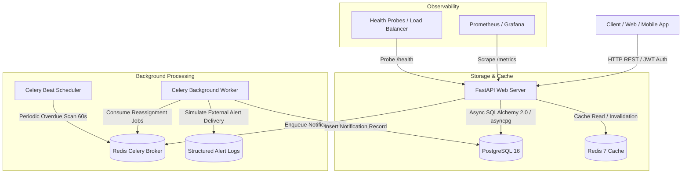

# ⚡ TaskFlow — Backend Task Management API with Asynchronous Notifications & Caching

[](https://github.com/amodchauhan/TaskFlow/actions)
[](https://www.python.org/downloads/)
[](https://fastapi.tiangolo.com)
[](https://www.postgresql.org)
[](https://redis.io)
[](https://docs.celeryq.dev)

A scalable, production-grade RESTful Task Management API built with **FastAPI**, **PostgreSQL** (async SQLAlchemy 2.0), **Redis** (cache-aside with zero-stale-read invalidation), and **Celery** (asynchronous background notifications and scheduled periodic overdue task scans).

---

## Table of Contents

- [System Architecture](#system-architecture)
- [Key Features](#key-features)
- [Quick Start (Docker Compose)](#quick-start-docker-compose)
- [Local Development Setup](#local-development-setup)
- [API Reference & Sample Requests](#api-reference--sample-requests)
  - [1. Authentication](#1-authentication)
  - [2. Projects & Authorization](#2-projects--authorization)
  - [3. Tasks, Filtering & Search](#3-tasks-filtering--search)
  - [4. Notifications](#4-notifications)
  - [5. Health & Observability](#5-health--observability)
- [Caching & Invalidation Strategy](#caching--invalidation-strategy)
- [Background Workers & Notification Engine](#background-workers--notification-engine)
- [Deployment Path](#deployment-path)
- [Assumptions & Design Choices](#assumptions--design-choices)
- [Tradeoffs & What I'd Do With More Time](#tradeoffs--what-id-do-with-more-time)
- [Test Suite & Quality Verification](#test-suite--quality-verification)

---

## System Architecture



---

## Key Features

1. **Robust Authentication & Security**:
   - Stateless **Bearer JWT** authentication with configurable token expiry.
   - **Argon2id** password hashing (`argon2-cffi`) using OWASP-recommended parameters (immune to GPU-accelerated cracking).
   - Strict password isolation: passwords are never logged, never returned in API responses, and validated for minimum complexity.

2. **Multi-Tenant Projects & Strict Authorization**:
   - Full CRUD operations on projects (`POST`, `GET`, `PATCH`, `DELETE`).
   - Hard multi-tenant authorization boundaries: a user cannot view, edit, or delete projects owned by other users (`403 Forbidden`).

3. **Task Management & Multi-Attribute Search**:
   - Tasks belong to projects and include `status` (`todo`, `in_progress`, `done`), `assignee`, and `due_date`.
   - `GET /api/v1/tasks` supports composable filtering by `status`, `assignee_id`, and `due_date` ranges (`due_date_from`, `due_date_to`), complete with cursor/offset pagination.

4. **Redis Caching with Zero-Stale-Read Invalidation**:
   - `GET /tasks` query responses are cached in Redis using deterministic SHA-256 parameter hashing.
   - Cache keys are tenant-isolated (`taskflow:cache:user:{user_id}:tasks:{hash}`).
   - Instant cache invalidation on any task create, update, delete, or status transition ensures **zero stale reads**.

5. **Asynchronous Notifications via Celery**:
   - **Task Reassignment**: Triggered asynchronously via Celery worker without blocking the HTTP request cycle.
   - **Overdue Task Detection**: Periodic Celery Beat worker runs every 60 seconds, scans for past-due unfinished tasks, and creates in-app notification records with simulated alert logging.
   - User notification inbox with unread tracking and `PATCH /notifications/{id}/read` / `POST /read-all` acknowledgment endpoints.

6. **Production Observability & Metrics**:
   - `GET /health`: Deep probe checking PostgreSQL connection latency (`SELECT 1`) and Redis latency (`PING`).
   - `GET /metrics`: Standard Prometheus exposition format tracking request volume, latency histograms, error rates, and in-flight requests.

---

## Quick Start (Docker Compose)

Bring up the entire stack (**PostgreSQL**, **Redis**, **FastAPI Server**, **Celery Worker**, and **Celery Beat**) with a single command:

```bash
# 1. Clone repository
git clone https://github.com/amodchauhan/TaskFlow.git
cd TaskFlow

# 2. Copy environment configuration
cp .env.example .env

# 3. Build and launch all containers in detached mode
docker compose up -d --build
```

### Verify Running Services

Once up, access the following endpoints:

| Service / Interface | URL | Description |
|---|---|---|
| **Interactive Swagger Docs** | [http://localhost:8000/api/v1/docs](http://localhost:8000/api/v1/docs) | Interactive API exploration and testing |
| **ReDoc Documentation** | [http://localhost:8000/api/v1/redoc](http://localhost:8000/api/v1/redoc) | Clean API schema reference |
| **Health Check Probe** | [http://localhost:8000/health](http://localhost:8000/health) | Deep DB and Redis connectivity check |
| **Prometheus Metrics** | [http://localhost:8000/metrics](http://localhost:8000/metrics) | Scrape metrics for Prometheus |

To inspect Celery worker logs in real time:

```bash
docker compose logs -f worker beat
```

---

## Local Development Setup

To run and debug TaskFlow locally outside Docker:

### 1. Prerequisites
- Python 3.11+
- PostgreSQL (running locally on port 5432)
- Redis (running locally on port 6379)

### 2. Environment Setup

```bash
# Create and activate virtual environment
python3 -m venv .venv
source .venv/bin/activate

# Install development and testing dependencies
pip install --upgrade pip
pip install -r requirements-dev.txt

# Configure environment
cp .env.example .env
```

### 3. Run Database Migrations

```bash
alembic upgrade head
```

### 4. Start the Application & Workers

```bash
# Terminal 1: FastAPI Web Server
uvicorn app.main:app --reload --port 8000

# Terminal 2: Celery Background Worker
celery -A app.workers.celery_app.celery_app worker --loglevel=info

# Terminal 3: Celery Beat Periodic Scheduler
celery -A app.workers.celery_app.celery_app beat --loglevel=info
```

---

## API Reference & Sample Requests

### 1. Authentication

#### Register a New User
```bash
curl -X POST http://localhost:8000/api/v1/auth/signup \
  -H "Content-Type: application/json" \
  -d '{
    "email": "alice@example.com",
    "password": "StrongPassword123!",
    "full_name": "Alice Wonderland"
  }'
```

#### Login & Receive JWT Token
```bash
curl -X POST http://localhost:8000/api/v1/auth/login \
  -H "Content-Type: application/json" \
  -d '{
    "email": "alice@example.com",
    "password": "StrongPassword123!"
  }'
```
*Response:*
```json
{
  "access_token": "eyJhbGciOiJIUzI1NiIsIn...",
  "token_type": "bearer",
  "expires_in": 3600,
  "user": {
    "id": 1,
    "email": "alice@example.com",
    "full_name": "Alice Wonderland",
    "is_active": true
  }
}
```

---

### 2. Projects & Authorization

#### Create a Project
```bash
curl -X POST http://localhost:8000/api/v1/projects \
  -H "Authorization: Bearer <TOKEN>" \
  -H "Content-Type: application/json" \
  -d '{
    "name": "E-Commerce Microservices",
    "description": "Core payments and order processing service"
  }'
```

#### List Projects (Paginated)
```bash
curl -X GET "http://localhost:8000/api/v1/projects?page=1&page_size=10" \
  -H "Authorization: Bearer <TOKEN>"
```

---

### 3. Tasks, Filtering & Search

#### Create a Task within a Project
```bash
curl -X POST http://localhost:8000/api/v1/projects/1/tasks \
  -H "Authorization: Bearer <TOKEN>" \
  -H "Content-Type: application/json" \
  -d '{
    "title": "Implement Stripe Webhook Listener",
    "description": "Handle customer payment succeeded and failed events",
    "status": "todo",
    "due_date": "2026-08-30T18:00:00Z",
    "assignee_id": 2
  }'
```

#### Search & Filter Tasks (Cache-Backed)
Filter tasks by `status`, `assignee_id`, and `due_date` range:
```bash
curl -X GET "http://localhost:8000/api/v1/tasks?status=todo&assignee_id=2&due_date_from=2026-08-25T00:00:00Z&due_date_to=2026-08-31T23:59:59Z&page=1&page_size=20" \
  -H "Authorization: Bearer <TOKEN>"
```

#### Update Task Status (Instant Cache Invalidation)
```bash
curl -X PATCH http://localhost:8000/api/v1/tasks/1 \
  -H "Authorization: Bearer <TOKEN>" \
  -H "Content-Type: application/json" \
  -d '{
    "status": "in_progress"
  }'
```

---

### 4. Notifications

#### List Current User Notifications
```bash
curl -X GET "http://localhost:8000/api/v1/notifications" \
  -H "Authorization: Bearer <TOKEN>"
```

#### Mark Notification as Read
```bash
curl -X PATCH http://localhost:8000/api/v1/notifications/1/read \
  -H "Authorization: Bearer <TOKEN>"
```

---

### 5. Health & Observability

#### Deep Health Probe
```bash
curl -X GET http://localhost:8000/health
```
*Response:*
```json
{
  "status": "healthy",
  "timestamp": "2026-08-24T10:45:00.123456+00:00",
  "version": "0.1.0",
  "environment": "production",
  "services": {
    "postgres": {
      "status": "healthy",
      "latency_ms": 1.42
    },
    "redis": {
      "status": "healthy",
      "latency_ms": 0.38
    }
  }
}
```

#### Prometheus Metrics
```bash
curl -X GET http://localhost:8000/metrics
```

---

## Caching & Invalidation Strategy

The assignment requires:
> *"`GET /tasks` should be cache-backed (Redis), with a sensible invalidation strategy on task updates — stale reads after a status change will be treated as a bug."*

### Key Design & Mechanics
1. **Deterministic Hashing**: When a user queries `GET /tasks`, query parameters (`status`, `assignee_id`, `due_date_from`, `due_date_to`, `page`, `page_size`) are sorted, sanitized, and hashed into a 16-character SHA-256 digest.
2. **Tenant Namespace Isolation**: Cache keys are structured as:
   ```
   taskflow:cache:user:{user_id}:tasks:{query_hash}
   ```
   This prevents any cross-tenant data leakage or collision.
3. **Instant Pattern Invalidation**: Whenever a task is created, updated (status changed, reassigned, edited), or deleted:
   - All keys under `taskflow:cache:user:{owner_id}:tasks:*` are immediately scanned and purged via `SCAN` + `DEL`.
   - If an assignee was involved, their cache namespace is also purged.
   - Subsequent `GET /tasks` calls are guaranteed to fetch fresh data directly from PostgreSQL and repopulate the cache without stale reads.
4. **Resilience**: If Redis is temporarily unreachable, the application logs a warning and falls back to direct database querying without failing client requests.

---

## Background Workers & Notification Engine

- **Asynchronous Task Reassignment**: Dispatches `notify_task_reassigned.delay(...)` to the Celery queue upon task assignment or reassignment. The worker persists a `Notification` entity and logs a simulated delivery event.
- **Scheduled Overdue Task Detection**: `celery_app.conf.beat_schedule` executes `check_overdue_tasks` every 60 seconds. It scans for unfinished tasks (`status != 'done'`) whose `due_date` is in the past, verifies no duplicate notification was sent in the current cycle, creates notification records for assignees/owners, and logs alert messages.

---

## Deployment Path

TaskFlow includes preconfigured, documented deployment configurations:

1. **Docker Compose (VM / Single-Node)**:
   - Run `./deploy/deploy.sh` to build, migrate, and start the complete containerized stack with automated health check verification.
2. **Render Blueprint (`deploy/render.yaml`)**:
   - Connect the repository to Render to provision a Web API service, Celery background worker, managed PostgreSQL database, and Redis instance in one click.
3. **Fly.io (`deploy/fly.toml`)**:
   - Deploy multi-process containers running FastAPI, Celery worker, and Celery beat on Fly.io edge infrastructure.

---

## Assumptions & Design Choices

1. **JWT vs. Session-Based Authentication**:
   - We chose **stateless Bearer JWT** tokens because TaskFlow is an API designed for multi-client consumption (Single Page Applications, mobile apps, third-party integrations). JWT avoids shared session state bottlenecks across horizontal API instances while allowing sub-millisecond cryptographic verification.
2. **Multi-Tenant Ownership Model**:
   - A user owns projects and the tasks within them. Assignees can be assigned to tasks across projects. Authorization is enforced at the project boundary: only project owners can view or modify project tasks.
3. **Simulated Notification Delivery**:
   - As specified in the prompt, notification records are saved to the `notifications` database table and formatted to standard output logs. The background worker architecture is structured so real email/SMS providers (e.g. SendGrid, AWS SES, Twilio) can be plugged in by adding a single delivery function inside `app/workers/tasks.py`.

---

## Tradeoffs & What I'd Do With More Time

Being candid about engineering tradeoffs:

1. **Transactional Outbox Pattern for Background Tasks**:
   - *Current Implementation*: Celery tasks are dispatched via `.delay()` inside the request lifecycle after database flush. If Redis happens to crash in the microsecond between the database commit and the Celery dispatch, the notification job could theoretically be lost.
   - *With More Time*: I would implement the **Transactional Outbox Pattern** by writing event records to an `outbox` table within the same ACID transaction as the task change, then running a Change Data Capture (CDC) or poller worker to publish to Redis with at-least-once delivery guarantees.

2. **Granular Tagged / Versioned Cache Invalidation**:
   - *Current Implementation*: Cache invalidation purges all queries for the affected user (`taskflow:cache:user:{user_id}:tasks:*`) via `SCAN` + `DEL`. For typical workloads this is fast (a few milliseconds).
   - *With More Time*: I would implement **Cache Versioning** (e.g., storing a `user:{user_id}:task_version` integer in Redis and embedding the version into the cache key). Incrementing the integer instantly invalidates all previous cache keys in $O(1)$ time without requiring a `SCAN` operation.

3. **Real-Time Notification Streaming (WebSockets / SSE)**:
   - *Current Implementation*: Users poll `GET /api/v1/notifications` to fetch their notifications.
   - *With More Time*: I would add a WebSocket endpoint (`/ws/notifications`) with Redis Pub/Sub so that when the background Celery worker creates a notification, it broadcasts it in real time to active connected browser sessions.

4. **Distributed Lock on Celery Beat**:
   - *Current Implementation*: A single Celery Beat instance is scheduled.
   - *With More Time*: For multi-replica high availability, I would wrap scheduled jobs in a Redis distributed lock (`Redlock`) to ensure that even if multiple scheduler instances run across clusters, only one leader executes the overdue task scan.

5. **Role-Based Access Control (RBAC) & Team Workspaces**:
   - *Current Implementation*: Strict individual project ownership.
   - *With More Time*: Add a `ProjectMember` association table with explicit roles (`admin`, `editor`, `viewer`) allowing collaborative team task management.

---

## Test Suite & Quality Verification

TaskFlow includes a 30-test suite covering core flows, tricky edge cases, authorization barriers, cache invalidation, and background workers:

```bash
# Run pytest with coverage report
pytest --cov=app --cov-report=term-missing tests/
```

### Test Suite Summary

- `tests/test_auth.py`: User registration, duplicate email rejection, Argon2 password hashing verification, JWT creation & expiration, unauthorized access rejection.
- `tests/test_projects.py`: Project CRUD operations, pagination, and multi-tenant authorization boundary tests (User B cannot view or edit User A's projects).
- `tests/test_tasks.py`: Task CRUD, status transitions (`todo` -> `in_progress` -> `done`), assignee verification, filtering by status, assignee, and ISO-8601 date ranges.
- `tests/test_caching.py`: Deterministic cache key generation, cache hits on repeated queries, and zero-stale-read verification upon task status updates and deletions.
- `tests/test_notifications.py`: Celery worker trigger assertions on task assignment, background overdue scanner verification, and notification inbox read/unread management.
- `tests/test_health_metrics.py`: PostgreSQL & Redis health checks, service latency measurements, and Prometheus exposition metrics verification.

---

## License

This project is licensed under the MIT License.

